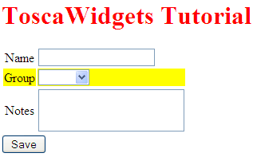
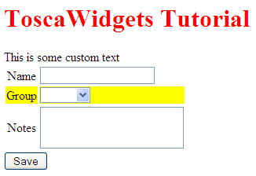

Customising the Form
====================

You can change the form structure by editing the definition in the code. The widget browser shows all the widgets and options available in tw2.forms.

To customise the appearance of the form, we need to use a stylesheet. Create ``myapp.css`` with this content::

    h1 { color: red; }
    th { font-weight: normal; }
    tr.even { background-color: yellow; }
    .required th { font-weight: bold; }
    .error span { font-weight: bold; color: red; }

Edit ``myapp.py`` and add to the ``TestPage`` class::

    resources = [twc.CSSLink(filename='myapp.css')]

When you view the form, you should see this:

To customise the layout of the page, we can use our own template for the ``Page`` widget. Create ``mypage.html`` with this content::

    <html>
        <head><title>$w.title</title></head>
        <body>
            <h1>$w.title</h1>
            This is some custom text
            ${w.child.display()}
        </body>
    </html>

Edit ``myapp.py`` and add to the ``TestPage`` class::

    template = 'genshi:%s/myapp.html' % os.getcwd()

The page should look this this:

With these three techniques to use, you should be able to customise the form in almost any way you need. I encourage you to experiment with this for a while, before continuing with the tutorial. We will later cover validation, and creating your own widgets.

.. note:: The tutorial used a simple approach for referring to the CSS and template files. This would not usually be used in a real application. See the design document for more information.

