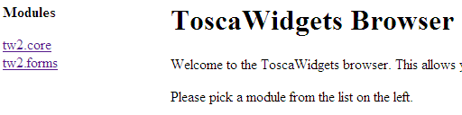
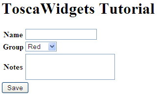

Tutorial
========

This tutorial will show you how to get ToscaWidgets 2 working with a WSGI application. You need to install tw2.core, tw2.devtools and tw2.forms, from the Mercurial repositories::

    hg clone http://bitbucket.org/paj/tw2core/ tw2.core
    hg clone http://bitbucket.org/paj/tw2devtools/ tw2.devtools
    hg clone http://bitbucket.org/paj/tw2forms/ tw2.forms

You need to run ``python setup.py develop`` for each repository.

You also need to install one of the supported templating engines - either Genshi or Mako.

To check the install worked, we will try to run the widget browser. Issue ``paster tw2.browser`` then browse to http://localhost:8000/. You should see the widget browser, like this:

Simple WSGI Application
-----------------------

We'll start by creating a simple WSGI application, using WebOB. Create ``myapp.py`` with the following::

    import webob as wo, wsgiref.simple_server as wrs, os

    def app(environ, start_response):
        req = wo.Request(environ)
        resp = wo.Response(request=req, content_type="text/html; charset=UTF8")
        resp.body = 'hello world'
        return resp(environ, start_response)

    if __name__ == "__main__":
        wrs.make_server('', 8000, app).serve_forever()

To check this works, run ``myapp.py``, and use a web browser to open ``http://localhost:8000/``. You should see ``hello world``.

.. note:: The finished files at the end of this tutorial are in the tw2.forms source repository, in the examples directory.

Using Widgets
-------------

We'll now add some widgets to the application. Update the code to this::

    import webob as wo, wsgiref.simple_server as wrs, os
    import tw2.core as twc, tw2.forms as twf

    class TestPage(twc.Page):
        title = 'ToscaWidgets Tutorial'
        class child(twf.TableForm):
            name = twf.TextField()
            group = twf.SingleSelectField(options=['', 'Red', 'Green', 'Blue'])
            notes = twf.TextArea()

    def app(environ, start_response):
        req = wo.Request(environ)
        resp = wo.Response(request=req, content_type="text/html; charset=UTF8")
        resp.body = TestPage.display().encode('utf-8')
        return resp(environ, start_response)

    if __name__ == "__main__":
        wrs.make_server('', 8000, twc.make_middleware(app)).serve_forever()

When you look at this with a browser, it should be like this:

TurboGears 2
------------

To enable ToscaWidgets 2.0, edit ``middleware.py`` and add, just before the ``return app`` line::

    app = twc.make_middleware(app, default_engine='genshi')

By default, TurboGears 2 has ToscaWidgets 0.9 enabled. The two libraries can co-exist, but for production sites it is recommended to only run one, for efficiency.

To disable ToscaWidgets 0.9, edit ``app_cfg.py`` and add at the end::

    base_config.use_toscawidgets = False
    
This prevents Catwalk from working, so in ``root.py`` comment out the following lines::

    #from catwalk.tg2 import Catwalk
    
    #admin = Catwalk(model, DBSession)

Creating Widgets
----------------

 * Decide what base class to use
 * Identify parameters
 * Write template
 * Add any ``prepare()`` code you need
